Analyzed repo: https://github.com/1chz/realworld-java21-springboot3
# Project Overview

This software project implements a content management and social interaction platform where users can create, modify, and interact with articles, tags, comments, and follow relationships. The system exposes RESTful endpoints for common operations such as article management, user authentication, tag retrieval, and social interactions, using a modular architecture that supports separation of concerns across different layers.

---

# Purpose and Main Functionality

The primary goal of the project is to provide a robust backend for a real-world blogging or social application. Key functionalities include:  
- **User Management:** Registration, authentication (with JWT-based security), profile updates, and managing follow/unfollow relationships.  
- **Article Management:** Creating, editing, deleting, and retrieving articles, along with support for favoriting and filtering articles using dynamic querying.  
- **Tag Management:** Assigning, processing, and retrieving tags to categorize articles.  
- **Comment Management:** Allowing users to write, retrieve, and delete comments on articles.  
- **Social Interactions:** Enabling social features such as following other users and favoriting articles.
  
---

# Architecture and Key Components

The project is structured into multiple modules, each with a clear role:

- ## API Module
  - **Controllers:**  
    - Exposes RESTful endpoints (e.g., ArticleController, TagController, UserController) that handle HTTP requests and orchestrate business logic.
  - **Request and Response DTOs:**  
    - Dedicated DTO subpackages parse incoming requests (e.g., user login, article creation) and format outgoing responses (e.g., ProfileResponse, ArticleResponse) for client consumption.
  - **Configuration:**  
    - Holds the security and web-related configuration, including custom JWT authentication converters, exception handling, and security filter setup.
  - **Testing:**  
    - Unit tests focused on API response integrity and configuration correctness ensure proper translation between domain models and JSON responses, as well as valid security configuration.
  
- ## Core Module
  - **Domain Models and Repositories:**  
    - Central business entities such as Article, User, Tag, and associative entities (e.g., ArticleTag, UserFollow) are defined here along with repository interfaces for data access.
  - **Service Layer:**  
    - Implements business logic around domain functionalities including article processing, tag management, user services, and social interactions.
  - **Test Fixtures:**  
    - Provides standardized data fixtures for reliable testing of domain models and service interactions.
  
- ## Persistence Module
  - **Configuration:**  
    - Contains data source and JPA auditing configurations, ensuring consistent persistence behavior.
  - **Repository Implementation:**  
    - Implements the persistence layer using JPA repository interfaces and adapters to handle queries and data storage effectively.

- ## Bootstrap Module
  - **Application Bootstrap:**  
    - Contains the main class that initiates the Spring Boot application and ensures that the runtime context is correctly loaded.
  - **Startup Tests:**  
    - Validates the application startup and verifies that the Spring Boot context loads correctly.

---

# Data Model and Entity Relationships

The domain model design revolves around several key entities and their relationships:

- **Tag:**  
  - Categorizes articles. Related to articles via the many-to-many join entity ArticleTag.
  
- **User:**  
  - Represents an application user who can author articles, comment, and follow other users. Relationships include authored articles, written comments, and social (follow) relationships.
  
- **UserFollow:**  
  - A join entity capturing follow relationships between users, linking a follower to a followed user.
  
- **Article:**  
  - Central to the content management system, an article holds content, description, and metadata. It is authored by a User and associated with Tags, Comments, and Favorites.
  
- **ArticleTag:**  
  - A join table for the many-to-many relationship between Articles and Tags.
  
- **ArticleFavorite:**  
  - Maps favoriting actions of users on articles.
  
- **ArticleComment:**  
  - Stores comments made by users on articles, linking a comment to its author and the associated article.
  
- **Auxiliary DTOs and Wrappers:**
  - **ArticleFacets:** Handles article filtering and pagination.
  - **RealWorldAuthenticationToken:** Wraps JWT authentication and provides token-related helper methods.
  - **UserRegistry:** Captures user registration data.
  - **ArticleDetails:** Consolidates detailed views of an article along with favorite count and user-specific details.
  - **ArticleCommentResponse and UserResponse:** Standardized DTOs used to format output for client-side consumption.

---

# Features

The project supports a wide array of features:
- **API Response Formatting:**  
  - Standardized and consistent JSON responses including multiple representations for articles, tags, and user profiles.
  
- **Article Operations:**  
  - Comprehensive CRUD operations on articles, including creation, editing, deletion, and dynamic querying facilitated via JPA specifications and pagination support.
  
- **User Management:**  
  - Advanced user handling including authentication, registration, profile update, password encryption (using BCrypt), and maintenance of follow/unfollow relationships.
  
- **Comment Management:**  
  - Facilitation of comment creation, listing, and deletion on a per-article basis.
  
- **Tag Management:**  
  - Processing, association, and retrieval of tags linked to articles to support content categorization.
  
- **Security and Authentication:**  
  - JWT-based authentication mechanism with custom bearer token provider, security filter chains, and dedicated token converters.
  
- **Centralized Exception Handling:**  
  - Uniform error handling mechanism mapping exceptions to specific HTTP problem details.
  
- **Persistence and Auditing:**  
  - Use of JPA repositories along with auditing features and enhanced SQL logging for query transparency.
  
- **Test Coverage:**  
  - Comprehensive unit tests across API, core, persistence, and bootstrap layers ensure reliability and correct functionality.

---

# Component Interactions

- **API Layer to Core Services:**  
  - REST controllers receive HTTP requests, transform incoming DTOs into core domain model instances, and delegate business processing to service layer classes (e.g., ArticleService, UserService, TagService).
  
- **Core Services to Persistence:**  
  - After processing business logic, services interact with the persistence layer via repository interfaces and adapters to query or store domain entities.
  
- **Security Configuration:**  
  - Custom JWT converters and authentication tokens ensure proper security context is passed from the client to the backend, and these tokens are used both in API request filtering and in constructing response profiles.
  
- **Test Interactions:**  
  - Test fixtures support reproducible tests across domain models and service interactions ensuring that the API and persistence operations adhere to business rules.
  
- **Dependency Graph:**  
  - The provided dependency graph (in MermaidJS) illustrates the flow between configuration elements, controllers, DTOs, core models, and services, showcasing the layered interactions and how data transformation takes place between these layers.

---

# Technologies and Frameworks

- **Java and Spring Boot:**  
  - Core framework facilitating dependency injection, configuration management, and REST API creation.
  
- **JPA (Java Persistence API):**  
  - For object-relational mapping and data persistence, along with specifications for dynamic querying.
  
- **JWT (JSON Web Tokens):**  
  - Implements security via token-based authentication for API access.
  
- **BCrypt:**  
  - Employed for secure password encoding.
  
- **MermaidJS:**  
  - Used (externally) for representing dependency graphs to illustrate component relationships.
  
- **Testing Frameworks:**  
  - Integrated unit tests across modules help ensure the application functions as expected. Specific tests include API response validation, service layer business rule confirmation, and Spring Boot context loading.

---

# Notable Patterns and Design Decisions

- **Separation of Concerns:**  
  - The project is organized into distinct modules (API, Core, Persistence, Bootstrap) that isolate responsibilities thereby enhancing maintainability and testability.
  
- **DTO Usage:**  
  - Decoupling internal domain models from external representations via request and response DTOs ensures the platform remains flexible to changes in internal logic without impacting external contracts.
  
- **JWT-based Security:**  
  - Custom authentication token wrappers and security configurations provide a modular approach to implementing secure endpoints.
  
- **Testing with Fixtures:**  
  - Real-world test fixtures streamline the testing process, ensuring consistent domain model behavior across unit and service tests.
  
- **Dynamic Querying with JPA Specifications:**  
  - Offers flexible filtering of articles based on criteria like tags, authors, and favorites, accommodating diverse client-side query needs.
  
- **Centralized Exception Handling:**  
  - Ensures a consistent error-response mechanism across the API, improving client-side error management.

---

This detailed overview encapsulates the project’s structure, functionality, and design considerations, providing a clear picture of its architecture, data modeling, component interactions, and supported features.

## Module Descriptions

### api/src/main/java/io/zhc1/realworld/api

Hosts REST controllers and supporting components that expose the application's endpoints. It handles business operations for articles, tags, comments, favorites, social interactions, and user account management, as well as token generation.

### api/src/main/java/io/zhc1/realworld/api/request

Holds request DTOs that parse and encapsulate incoming API request data for operations such as user authentication, registration, article creation, editing, and commenting.

### api/src/main/java/io/zhc1/realworld/api/response

Contains API response Data Transfer Objects (DTOs) that format and relay domain model information to the client in a structured, JSON-friendly format.

### api/src/main/java/io/zhc1/realworld/config

Contains configuration classes related to security and web-layer settings. This includes custom JWT authentication converters, centralized exception handlers, security filter chain configuration, and authentication token wrappers.

### api/src/test/java/io/zhc1/realworld/api/response

Houses test cases for API response objects to verify that data transformations (e.g., from domain models to API responses) are performed correctly.

### api/src/test/java/io/zhc1/realworld/config

Contains unit tests for configuration components including security password encoding, object mapper customization, exception handling, and bearer token resolution.

### bootstrap/src/main/java/io/zhc1/realworld

Holds the main application bootstrap class which starts the Spring Boot application.

### bootstrap/src/test/java/io/zhc1/realworld

Contains tests for the application, ensuring that the Spring Boot context loads and the application functions as expected during startup.

### core/src/main/java/io/zhc1/realworld/core/model

This module contains the core domain models, repository interfaces, and data transfer objects (records) for the application. It defines the business entities such as Article, User, Tag, and their relationships, as well as interfaces for persisting and querying these entities.

### core/src/main/java/io/zhc1/realworld/core/service

Encapsulates business logic and service layer implementations for various domain functionalities including tag, user, social interactions, articles, and article comments.

### core/src/test/java/io/zhc1/realworld/core/model

Includes unit tests for core domain models (Tag, User, UserFollow, ArticleFacets) to ensure validations, equality checks, and business rules are correctly implemented.

### core/src/test/java/io/zhc1/realworld/core/service

Holds unit tests for the service layer classes (ArticleService, TagService, UserService, SocialService, ArticleCommentService). These tests verify business logic and interactions with repositories and domain models.

### core/src/testFixtures/java/io/zhc1/realworld/core/model

Contains test fixtures with concrete implementations of domain models (TestUser, TestArticle, TestTag, TestUserFollow) to be used in unit and service tests.

### persistence/src/main/java/io/zhc1/realworld/config

Provides configuration classes for the persistence layer, including JPA auditing and custom data source logging configuration.

### persistence/src/main/java/io/zhc1/realworld/persistence

Implements the persistence layer by providing JPA repository interfaces, repository adapters, and utility classes (such as specifications) for querying and storing core domain models like Article, User, ArticleComment, and Tag.

## Project Dependency Graph

```mermaid
%% MermaidJS graph representing updated dependencies
graph TD

subgraph API_Config
  RealWorldJwtAuthConv[RealWorldJwtAuthenticationConverter]
  InterceptorsExceptionHandler[InterceptorsExceptionHandler]
  SecurityConfig[SecurityConfiguration]
  RealWorldAuthToken[RealWorldAuthenticationToken]
end

subgraph API_Controllers
  ArticleCtrl[ArticleController]
  TagCtrl[TagController]
  BearerTokenProvider[RealWorldBearerTokenProvider]
  ArticleCommentCtrl[ArticleCommentController]
  ArticleFavoriteCtrl[ArticleFavoriteController]
  SocialCtrl[SocialController]
  UserCtrl[UserController]
end

subgraph API_Responses
  TagsResp[TagsResponse]
  ProfileResp[ProfileResponse]
  UsersResp[UsersResponse]
  ArticleResp[ArticleResponse]
  SingleArticleResp[SingleArticleResponse]
  MultipleArticlesResp[MultipleArticlesResponse]
  ProfilesResp[ProfilesResponse]
end

subgraph API_Requests
  UpdateUserReq[UpdateUserRequest]
  LoginUserReq[LoginUserRequest]
  WriteCommentReq[WriteCommentRequest]
  EditArticleReq[EditArticleRequest]
  SignupReq[SignupRequest]
  WriteArticleReq[WriteArticleRequest]
end

subgraph Core_Models
  Tag[Tag]
  User[User]
  Article[Article]
  ArticleTag[ArticleTag]
  ArticleDetails[ArticleDetails]
end

%% API_Config dependencies
SecurityConfig --> RealWorldJwtAuthConv
RealWorldJwtAuthConv --> RealWorldAuthToken

%% API_Controllers dependencies on Core Services
ArticleCtrl --> UserService[UserService]
ArticleCtrl --> ArticleService[ArticleService]
TagCtrl --> TagService[TagService]
ArticleCommentCtrl --> ArticleService
ArticleCommentCtrl --> UserService
ArticleCommentCtrl --> SocialService[SocialService]
ArticleCommentCtrl --> ArticleCommentService[ArticleCommentService]
ArticleFavoriteCtrl --> UserService
ArticleFavoriteCtrl --> ArticleService
SocialCtrl --> UserService
SocialCtrl --> SocialService
UserCtrl --> UserService
UserCtrl --> BearerTokenProvider
BearerTokenProvider --> JwtEncoder[JwtEncoder]

%% API_Responses dependencies
TagsResp --> Tag
ProfileResp --> User
UsersResp --> User
ArticleResp --> Article
ArticleResp --> ArticleDetails
ArticleResp --> Tag
ArticleResp --> User
SingleArticleResp --> ArticleResp
MultipleArticlesResp --> ArticleResp
ProfilesResp --> ProfileResp

%% API_Requests dependencies
WriteArticleReq --> Tag

%% Note: Request DTOs encapsulate incoming data; transformation to core models occurs inside helper methods
```

## File Descriptions

### api/src/main/java/io/zhc1/realworld/api/ArticleCommentController.java

Provides RESTful endpoints for creating, retrieving, and deleting comments on articles. It integrates with article, user, social, and comment services to perform these operations.

### api/src/main/java/io/zhc1/realworld/api/ArticleController.java

Handles API endpoints for article operations, including creating, retrieving, updating, and deleting articles, as well as retrieving a personalized feed. It leverages user and article services and makes use of the custom authentication token for user context.

### api/src/main/java/io/zhc1/realworld/api/ArticleFavoriteController.java

Manages endpoints for favoriting and unfavoriting articles. It retrieves user and article information and then uses the ArticleService to update favorite status.

### api/src/main/java/io/zhc1/realworld/api/RealWorldBearerTokenProvider.java

Generates JWT tokens for authenticated users during login. It builds JWT claims (issuer, subject, issue and expiry time) and encodes them using the configured JwtEncoder.

### api/src/main/java/io/zhc1/realworld/api/SocialController.java

Handles profile-related actions such as retrieving profiles and managing follow/unfollow operations, interacting with the user and social services.

### api/src/main/java/io/zhc1/realworld/api/TagController.java

Exposes an endpoint for retrieving a list of tags. It delegates the retrieval process to the TagService.

### api/src/main/java/io/zhc1/realworld/api/UserController.java

Manages user-related endpoints including signup, login, profile retrieval, and updates. It uses the UserService for user management and the RealWorldBearerTokenProvider to issue access tokens upon successful login.

### api/src/main/java/io/zhc1/realworld/api/request/EditArticleRequest.java

Defines a DTO for editing an article, containing updated title, description, and body inside a nested Params record.

### api/src/main/java/io/zhc1/realworld/api/request/LoginUserRequest.java

Carries user login credentials (email and password) in a request DTO. It provides a constructor to build the DTO from separate email and password parameters.

### api/src/main/java/io/zhc1/realworld/api/request/SignupRequest.java

Carries new user registration information (email, username, and password) in a DTO using a nested Params record.

### api/src/main/java/io/zhc1/realworld/api/request/UpdateUserRequest.java

Defines a request DTO for updating user information, encapsulating email, username, password, bio, and image inside a nested Params record.

### api/src/main/java/io/zhc1/realworld/api/request/WriteArticleRequest.java

Defines a request DTO for creating an article with title, description, body, and a list of tag names. It includes a helper method to convert the tag names into a set of Tag domain objects.

### api/src/main/java/io/zhc1/realworld/api/request/WriteCommentRequest.java

Encapsulates the content of a comment in a DTO used for creating new comments, with the comment body inside a nested Params record.

### api/src/main/java/io/zhc1/realworld/api/response/ArticleCommentResponse.java

A record type that formats an ArticleComment domain model into a response payload, including details like id, timestamps, body content, and the associated author's profile.

### api/src/main/java/io/zhc1/realworld/api/response/ArticleResponse.java

Formats article details into a response DTO. It aggregates information from an Article and its associated tags, timestamps, favoritism information, and author profile via ProfileResponse.

### api/src/main/java/io/zhc1/realworld/api/response/MultipleArticlesResponse.java

Provides a response DTO for multiple articles, including a list of ArticleResponse objects and a computed articles count.

### api/src/main/java/io/zhc1/realworld/api/response/MultipleCommentsResponse.java

A simple record that wraps a list of ArticleCommentResponse objects for endpoints returning multiple comments.

### api/src/main/java/io/zhc1/realworld/api/response/ProfileResponse.java

Creates a profile response with user details (username, bio, image) and a following flag. It includes helper methods to build the DTO from a domain User.

### api/src/main/java/io/zhc1/realworld/api/response/ProfilesResponse.java

Wraps a ProfileResponse for a user profile and offers static factory methods to build the profile response from a User object with an optional following flag.

### api/src/main/java/io/zhc1/realworld/api/response/SingleArticleResponse.java

Encapsulates a single ArticleResponse, allowing for a simplified conversion from an ArticleDetails composite object.

### api/src/main/java/io/zhc1/realworld/api/response/SingleCommentResponse.java

A record type that encapsulates a single ArticleCommentResponse, used as the payload for endpoints returning one comment.

### api/src/main/java/io/zhc1/realworld/api/response/TagsResponse.java

Defines a response DTO for returning a list of tag names. It converts a collection of domain Tag objects into an array of strings.

### api/src/main/java/io/zhc1/realworld/api/response/UserResponse.java

Defines a response record for user-related API output with fields for email, token, username, bio, and image.

### api/src/main/java/io/zhc1/realworld/api/response/UsersResponse.java

Wraps a UserResponse DTO that includes a token and user details, providing a convenient factory method to convert a domain User into a response.

### api/src/main/java/io/zhc1/realworld/config/InterceptorsExceptionHandler.java

Provides centralized exception handling for REST controllers, mapping various exceptions to corresponding HTTP error responses using ProblemDetail.

### api/src/main/java/io/zhc1/realworld/config/ObjectMapperConfiguration.java

A configuration class for customizing the Jackson ObjectMapper. It registers a module to serialize LocalDateTime objects in the ISO8601 format used across the application.

### api/src/main/java/io/zhc1/realworld/config/RealWorldAuthenticationToken.java

Defines a custom authentication token that wraps a JwtAuthenticationToken. It delegates most operations to the underlying token and adds methods to extract the token value and the user ID (as a UUID).

### api/src/main/java/io/zhc1/realworld/config/RealWorldBearerTokenResolver.java

A custom implementation of BearerTokenResolver that extracts bearer tokens from HTTP requests. It recognizes tokens using a custom prefix 'Token' and validates them via a regular expression pattern; it also handles token extraction from request parameters.

### api/src/main/java/io/zhc1/realworld/config/RealWorldJwtAuthenticationConverter.java

Converts a Jwt into an AbstractAuthenticationToken by extracting granted authorities and the subject claim, and then wrapping it within a RealWorldAuthenticationToken.

### api/src/main/java/io/zhc1/realworld/config/SecurityConfiguration.java

Configures Spring Security for the application. It sets up HTTP security (disabling CSRF, form login, etc.), CORS, session management, exception handling, JWT decoder/encoder beans, and registers a custom bearer token resolver and JWT authentication converter.

### api/src/main/java/io/zhc1/realworld/config/SecurityPasswordEncoderAdapter.java

A Spring component that adapts the core PasswordEncoder interface to Spring Security’s BCryptPasswordEncoder, enabling password encoding and matching for user authentication.

### api/src/test/java/io/zhc1/realworld/api/response/ProfileResponseTest.java

Tests the ProfileResponse creation from a User model, ensuring that the proper username is returned instead of the email.

### api/src/test/java/io/zhc1/realworld/config/InterceptorsExceptionHandlerTest.java

Unit tests that verify the behavior of the application's exception handler, mapping various exceptions to appropriate HTTP problem details including status codes and messages.

### api/src/test/java/io/zhc1/realworld/config/ObjectMapperConfigurationTest.java

Tests that validate the custom ObjectMapper configuration for serializing and deserializing LocalDateTime objects to and from ISO8601 formatted strings.

### api/src/test/java/io/zhc1/realworld/config/RealWorldBearerTokenResolverTest.java

Tests for the custom RealWorldBearerTokenResolver ensuring that bearer tokens are correctly extracted from the Authorization header or request parameters, and that error conditions (such as multiple tokens) are handled properly.

### api/src/test/java/io/zhc1/realworld/config/SecurityPasswordEncoderAdapterTest.java

Unit tests for SecurityPasswordEncoderAdapter verifying that it correctly encodes passwords and validates matching and non-matching credentials.

### bootstrap/src/main/java/io/zhc1/realworld/RealWorldApplication.java

The main entry point of the application. It bootstraps the Spring Boot application.

### bootstrap/src/test/java/io/zhc1/realworld/RealWorldApplicationTest.java

A test class ensuring that the Spring Boot application context can load successfully, verifying application startup correctness.

### core/src/main/java/io/zhc1/realworld/core/model/Article.java

A JPA entity representing an article. It includes details such as title, slug, content, description, and timestamps, and establishes relationships with the User (author) and a set of ArticleTag entities.

### core/src/main/java/io/zhc1/realworld/core/model/ArticleComment.java

A JPA entity representing a comment on an article. It links to an Article and its author (User) and stores the content along with the creation timestamp.

### core/src/main/java/io/zhc1/realworld/core/model/ArticleCommentRepository.java

A repository interface for the ArticleComment entity. It defines methods to save comments, find comments by article or ID, and to delete comments.

### core/src/main/java/io/zhc1/realworld/core/model/ArticleDetails.java

A record (immutable DTO) that wraps an Article with additional details like favorites count and favorited status. It also provides a method to retrieve associated tags.

### core/src/main/java/io/zhc1/realworld/core/model/ArticleFacets.java

A record used as a data transfer object for query parameters when searching for articles. It includes filters like tag, author, favorited status and supports pagination.

### core/src/main/java/io/zhc1/realworld/core/model/ArticleFavorite.java

A JPA entity that models a favorite relationship between a User and an Article. It contains references to both and a timestamp indicating when the favorite was created.

### core/src/main/java/io/zhc1/realworld/core/model/ArticleFavoriteRepository.java

A repository interface for managing ArticleFavorite entities. It provides methods to save a favorite, delete a favorite association, and check if a favorite exists by a specific user for a given article.

### core/src/main/java/io/zhc1/realworld/core/model/ArticleRepository.java

A repository interface for managing Article entities. It provides methods for saving articles (with or without associated tags), querying articles by various facets, retrieving article details, and deleting articles.

### core/src/main/java/io/zhc1/realworld/core/model/ArticleTag.java

A JPA entity serving as the join table between Article and Tag. It maintains the association between a specific article and a tag and includes its own creation timestamp.

### core/src/main/java/io/zhc1/realworld/core/model/PasswordEncoder.java

A core interface defining password encryption and verification operations used by the User model to secure passwords.

### core/src/main/java/io/zhc1/realworld/core/model/SocialRepository.java

A repository interface for social interactions, specifically managing the UserFollow entity. It supports saving, querying, and deleting follow relationships between users.

### core/src/main/java/io/zhc1/realworld/core/model/Tag.java

A JPA entity representing a tag that can be associated with articles. It includes a name and a creation timestamp, along with equality based on the tag name.

### core/src/main/java/io/zhc1/realworld/core/model/TagRepository.java

A core interface for the Tag repository responsible for fetching all tags from the datastore.

### core/src/main/java/io/zhc1/realworld/core/model/User.java

A JPA entity that models a user in the system. It contains user credentials and profile information, including email, username, password, bio, and image URL. Methods support updating properties and password encryption.

### core/src/main/java/io/zhc1/realworld/core/model/UserFollow.java

A JPA entity representing the follow relationship between users. It links a follower and a following User, ensuring uniqueness, with a timestamp for when the follow was created.

### core/src/main/java/io/zhc1/realworld/core/model/UserRegistry.java

A record that encapsulates the necessary registration information for a new user, including email, username, and password with validations.

### core/src/main/java/io/zhc1/realworld/core/model/UserRepository.java

A repository interface for the User entity. It contains methods for saving, finding (by ID, email, username), checking existence, and updating user details.

### core/src/main/java/io/zhc1/realworld/core/service/ArticleCommentService.java

Handles article comment operations such as retrieving a comment, listing comments for an article, writing new comments, and deleting comments with authorization checks.

### core/src/main/java/io/zhc1/realworld/core/service/ArticleService.java

Encompasses article management functions including fetching articles (with various facets), writing new articles with tags, editing article fields (title, description, content), deleting articles, and handling favorite/unfavorite operations along with retrieving detailed article views.

### core/src/main/java/io/zhc1/realworld/core/service/SocialService.java

Implements social interactions among users, notably follow and unfollow operations by checking and updating follow relationships via the social repository.

### core/src/main/java/io/zhc1/realworld/core/service/TagService.java

Provides business logic for tag management. It handles retrieval of all tags by interfacing with the tag repository.

### core/src/main/java/io/zhc1/realworld/core/service/UserService.java

Manages user-related operations including fetching users, user registration (signup), login, and updating user details. It leverages the user repository and password encoder.

### core/src/test/java/io/zhc1/realworld/core/model/ArticleFacetsTest.java

Unit tests for the ArticleFacets class which handles pagination. It validates that negative page numbers, negative page size, or page sizes exceeding limits throw appropriate exceptions.

### core/src/test/java/io/zhc1/realworld/core/model/TagTest.java

Unit tests for the Tag model. It verifies validations on tag names (non-null/non-empty) and ensures that equals and hashCode methods behave correctly, using a fixed TestTag implementation from test fixtures.

### core/src/test/java/io/zhc1/realworld/core/model/UserFollowTest.java

Unit tests for the UserFollow model. It validates proper initialization of follower and following attributes and ensures that exception throwing and equality comparisons work as expected, with support from a TestUserFollow fixture.

### core/src/test/java/io/zhc1/realworld/core/model/UserTest.java

Unit tests for the User model. It tests user properties such as email, username, bio, image URL, password encryption, and proper behavior of setters, equals and hashCode methods, using a TestUser fixture and a mock PasswordEncoder.

### core/src/test/java/io/zhc1/realworld/core/service/ArticleCommentServiceTest.java

Service layer tests for article comments. They verify operations such as fetching, writing, and deleting comments. The tests simulate repository behavior and check validations like permission to delete comments.

### core/src/test/java/io/zhc1/realworld/core/service/ArticleServiceTest.java

Service layer tests for the ArticleService. They cover a wide range of functionalities including fetching articles (with and without pagination facets), editing various attributes (title, description, content), deleting articles, favoriting/unfavoriting articles, and retrieving article details, using mocks for repositories and social relationships.

### core/src/test/java/io/zhc1/realworld/core/service/SocialServiceTest.java

Service layer tests for social features. It verifies the follow and unfollow functionalities, and checks whether a user is following another using the SocialRepository.

### core/src/test/java/io/zhc1/realworld/core/service/TagServiceTest.java

Service layer tests for the TagService. It checks that retrieving all tags works as expected by interacting with the TagRepository.

### core/src/test/java/io/zhc1/realworld/core/service/UserServiceTest.java

Service layer tests for the UserService. The tests validate user-related operations such as retrieving users by id or username, signing up (with duplicate checks), logging in (with password verification), and updating user details.

### core/src/testFixtures/java/io/zhc1/realworld/core/model/TestArticle.java

A test fixture extending the Article model, enabling tests to work with articles having a fixed identifier.

### core/src/testFixtures/java/io/zhc1/realworld/core/model/TestTag.java

A test fixture for the Tag model that returns a fixed tag name. Helps in ensuring predictable behavior when testing tag-related functionalities.

### core/src/testFixtures/java/io/zhc1/realworld/core/model/TestUser.java

A test fixture for the User model that assigns a fixed UUID to facilitate consistent testing of user properties and behaviors.

### core/src/testFixtures/java/io/zhc1/realworld/core/model/TestUserFollow.java

A test fixture providing a concrete implementation of the UserFollow model with a fixed ID. It is used in testing to simulate existing follow relationships.

### persistence/src/main/java/io/zhc1/realworld/config/DataSourceConfiguration.java

Configures the data source logging strategy using P6Spy. It customizes SQL log formatting to provide pretty-printed SQL queries along with execution details and stack trace information.

### persistence/src/main/java/io/zhc1/realworld/config/JpaConfiguration.java

A configuration class for enabling JPA auditing which automatically populates audit-related fields in entities.

### persistence/src/main/java/io/zhc1/realworld/persistence/ArticleCommentJpaRepository.java

A JPA repository interface for ArticleComment entities. It defines methods for retrieving comments for a specific article and deleting comments by article.

### persistence/src/main/java/io/zhc1/realworld/persistence/ArticleCommentRepositoryAdapter.java

An adapter that implements the ArticleCommentRepository interface by delegating operations to the underlying ArticleCommentJpaRepository for CRUD operations on ArticleComment entities.

### persistence/src/main/java/io/zhc1/realworld/persistence/ArticleFavoriteJpaRepository.java

A JPA repository interface managing ArticleFavorite entities. It provides methods to check existence, count favorites, and delete favorite records based on user and article.

### persistence/src/main/java/io/zhc1/realworld/persistence/ArticleFavoriteRepositoryAdapter.java

Adapts the ArticleFavoriteRepository interface to the persistence layer. It wraps the ArticleFavoriteJpaRepository to offer favorite and unfavorite functionalities.

### persistence/src/main/java/io/zhc1/realworld/persistence/ArticleJpaRepository.java

A JPA repository interface for the Article entity. It extends JpaRepository and JpaSpecificationExecutor to support basic CRUD and specification-based queries, including finding articles by slug, by authors, and filtering based on criteria.

### persistence/src/main/java/io/zhc1/realworld/persistence/ArticleRepositoryAdapter.java

Implements the ArticleRepository interface, enabling operations such as saving articles (with tags), fetching articles based on facets, retrieving detailed article information, and deleting articles. It integrates several JPA repositories internally.

### persistence/src/main/java/io/zhc1/realworld/persistence/ArticleSpecifications.java

Provides static methods to build JPA Specification filters for Article queries, including filtering by author name, tag name, and favorited username.

### persistence/src/main/java/io/zhc1/realworld/persistence/SocialRepositoryAdapter.java

Implements the SocialRepository interface by adapting it to Spring Data JPA. It handles persistence operations for user follow actions.

### persistence/src/main/java/io/zhc1/realworld/persistence/TagJpaRepository.java

A simple JPA repository interface for managing Tag entities.

### persistence/src/main/java/io/zhc1/realworld/persistence/TagRepositoryAdapter.java

Adapts the TagRepository interface to the persistence layer using Spring Data JPA. It primarily delegates to TagJpaRepository to fetch all tags.

### persistence/src/main/java/io/zhc1/realworld/persistence/UserFollowJpaRepository.java

A JPA repository interface for performing CRUD operations on UserFollow entities, providing methods for finding, deleting, and checking existence of follower-following relationships.

### persistence/src/main/java/io/zhc1/realworld/persistence/UserJpaRepository.java

A JPA repository interface for User entities that provides methods to find a user by email or username and to check the existence of users by email and/or username.

### persistence/src/main/java/io/zhc1/realworld/persistence/UserRepositoryAdapter.java

An adapter for the UserRepository interface that handles persistence for User entities. It uses the UserJpaRepository for standard CRUD operations and includes a method to update user details with password encoding and uniqueness checks.
