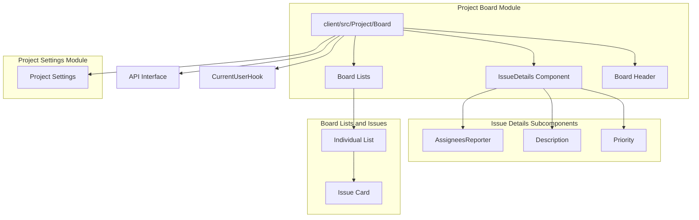

Analyzed repo: https://github.com/oldboyxx/jira_clone/tree/master

# Project Overview

This project is a full-stack web application that centers around managing projects and tasks through a Kanban board interface. It offers robust functionalities for issue tracking, user authentication, project management, and real-time interaction, making it suitable for both individual and team-based work environments.

---

# Purpose and Main Functionality

- **Project Management:** Offers the creation, organization, and update of projects with detailed settings, including project information and issue management.
- **Issue Tracking:** Enables users to create, update, and manage issues with detailed attributes such as status, type, priority, estimates, and comments.
- **Collaboration:** Facilitates user interactions through comprehensive authentication, user assignment, comment management, and real-time notifications.
- **Real-Time UI Updates:** Implements an optimistic update mechanism for a responsive and interactive user experience during API operations.
- **Extensive Testing:** Uses end-to-end (E2E) testing with Cypress and unit testing with Jest to ensure a stable application environment.

---

# Architecture and Key Components

The project is split into two main areas: the API backend and the client-side frontend.

## API (Backend)
- **Configuration & Setup:** Bootstraps the project with TypeScript configurations and path adjustments, ensuring a structured TypeScript environment.
- **Server Initialization & Routing:** Initializes the Express server and integrates middleware for request parsing, error handling, and authentication.
- **Controllers and Middleware:** 
  - Controllers handle HTTP requests, invoke business logic through services, and produce standardized API responses.
  - Middleware modules extend Express functionalities with authentication checks, error handlers, and response formatters.
- **Database Management:** Uses TypeORM for data modeling and abstraction over the database. It supports seeding to create initial test or guest accounts.
- **Error Handling and Utilities:** Implements custom error handling wrappers and utility functions (e.g., JWT management) to streamline backend operations.

## Client (Frontend)
- **Application Structure:** Comprises a React-based client application that interfaces with the backend APIs and manages routing, state, and UI rendering.
- **Project Board & Issue Details:**
  - **Kanban Board:** The board displays issues organized in lists that represent different statuses. It supports drag-and-drop functionality for dynamic issue reordering.
  - **Issue Details:** Detailed views of issues include sections for title, description, comments, time tracking, and user assignments.
- **Reusable UI Components:**
  - Common components include buttons, inputs, avatars, tooltips, date pickers, and rich text editors used throughout the application.
  - Shared components are designed for consistency, reusability, and responsiveness.
- **Testing and Bundling:**
  - Integration tests via Cypress validate the user interface and interactions.
  - Jest configurations and webpack setup manage the asset bundling process for both development and production environments.

---

# Data Model and Entity Relationships

The application uses a relational data model defined as TypeORM entities with clear relationships:

## User
- **Attributes:** email, name, avatarUrl, id, timestamps, projectId.
- **Relationships:**
  - Belongs to one Project.
  - Can report, be assigned to, or be a member of many Issues.
  - Can author multiple Comments.

## Project
- **Attributes:** name, url (slug), description, category, id, timestamps, issues, and users.
- **Relationships:**
  - Contains many Issues.
  - Comprises multiple Users as team members.

## Issue
- **Attributes:** title, type, status, priority, list position, description, time estimates (estimate, timeSpent, timeRemaining), id, timestamps, reporterId, projectId, assigned users, comments.
- **Relationships:**
  - Belongs to one Project.
  - Linked with one reporter (User) and multiple assigned Users.
  - Contains many Comments.

## Comment
- **Attributes:** body, id, timestamps, userId, issueId, and associated User details.
- **Relationships:**
  - Authored by one User.
  - Associated with one Issue.

---

# Features

- **Robust API Communication:** Incorporates error handling, mutations (create, update, delete), and lazy loading querying capabilities with caching.
- **Task and Issue Management:** Supports detailed issue creation, inline editing, drag-and-drop reordering, and filtering by various criteria.
- **User Authentication:** Utilizes JWT-based authentication for securing API endpoints and managing guest accounts.
- **UI/UX Enhancements:** Includes auto-resizing textareas, rich text editors (using Quill), customizable buttons, dynamic tooltips, and responsive designs.
- **Testing Infrastructure:** Integrates Cypress for E2E testing and Jest for unit and snapshot tests, supported by custom command definitions.
- **Reusable Components:** Implements shared UI libraries (e.g., Avatar, Input, Button, DatePicker) and hooks (e.g., for API interactions and current user retrieval) to promote consistency and ease of development.
- **Error Management:** Custom error definitions and asynchronous error handling wrappers ensure reliable feedback and error reporting across the application.
- **Database Seeding:** Provides initial data seeding for testing and guest account creation, facilitating rapid development and testing cycles.

---

# Component Interaction

- **API and Frontend Integration:** The client consumes the API endpoints to fetch and mutate data. React hooks built for API communication ensure that API responses integrate smoothly into the UI state.
- **Component Composition:** 
  - The Project Board module aggregates various subcomponents (e.g., Lists, Issue Details, Header) to render a holistic board view.
  - The Issue Details component breaks down into smaller subcomponents, such as AssigneesReporter, Description, and Priority, each encapsulating a specific piece of functionality.
- **State Management and Routing:** 
  - Custom hooks merge state updates, handle outside clicks and keyboard events, and manage browser history for seamless navigation.
  - Query parameter controlled modals and routing ensure that project settings and issue details are rendered based on user interactions and URL state.
- **Design Pattern Consistency:** The project adopts a modular design pattern where domain-specific components, shared components, and utilities are clearly separated. This approach promotes code reusability and simplifies testing.

---

# Technologies and Frameworks

- **Backend:**
  - Node.js with Express for server-side logic and routing.
  - TypeORM for ORM and database abstraction.
  - TypeScript for strong typing and code clarity.
- **Frontend:**
  - React for building the user interface.
  - React Router for managing client-side navigation.
  - Webpack for module bundling in both development and production.
  - Styled-components for CSS-in-JS styling.
  - Cypress for integration and E2E testing.
  - Jest for unit and snapshot testing.
- **Utilities:**
  - Formik for form management and validation.
  - Quill for rich text editing.
  - Custom hooks and utility functions for common tasks such as date formatting, API requests, and DOM interaction.
- **Testing:**
  - Cypress, with its dedicated plugins and support files, for comprehensive E2E testing.
  - Jest configurations and mocks ensure proper unit testing of components and modules.

---

# Notable Patterns and Design Decisions

- **Modular Architecture:** Clear separation between API and client code, with distinct directories for business logic, UI components, and utilities. This separation promotes maintainability and scalability.
- **Domain-Driven Design:** Entities such as User, Project, Issue, and Comment are modeled with rich relationships and encapsulate core business logic.
- **Optimistic UI Updates:** The frontend supports optimistic UI updates for a more responsive user experience during API interactions.
- **Reusability and Consistency:** Shared components and hooks serve as reusable building blocks across the project, enforcing consistency in both design and behavior.
- **Extensive Error Handling:** Custom error modules and middleware are implemented across both the backend and frontend, ensuring robust error detection and reporting.
- **Testing Focus:** The application incorporates a strong emphasis on automated testing, providing reliable regression testing and ensuring that new features do not break existing functionality.

---

This detailed overview outlines the project's purpose, architecture, data model, core features, and the interaction between its various components. The design decisions and technology choices reflect an approach focused on modularity, reusability, and a seamless user-rich experience.

## Module Descriptions

### api

Contains configuration and setup scripts that are used to bootstrap the project, including TypeScript path adjustments.

### api/src

Houses the main application source code including server initialization, routing, middleware integrations, database connections, constants, types, and utilities.

### api/src/constants

Defines constant values and enumerations for the application, standardizing categories and classifications for projects and issues.

### api/src/controllers

Contains controller modules that handle incoming HTTP requests, process business logic, and formulate responses using services, serializers, and error handling.

### api/src/database

Contains modules responsible for establishing database connections and seeding the database with initial or test data.

### api/src/entities

Contains the domain data model definitions as TypeORM entities. These models represent core business entities such as User, Comment, and Issue, and their relationships.

### api/src/errors

Includes custom error definitions and asynchronous error handling wrappers to ensure consistent error management throughout the API.

### api/src/middleware

Contains middleware components that extend Express functionality, such as error handling, authentication, and response standardization.

### api/src/serializers

Provides functions for formatting and transforming data objects (e.g., picking specific fields) before they are sent in API responses.

### api/src/types

Provides TypeScript declaration files that extend and enforce types for environment variables and Express interfaces.

### api/src/utils

Offers utility functions including JWT token management and generic database operations to support common functionalities across the application.

### client

Holds the client-side application code including the Express server for serving static assets and the webpack configurations for bundling the application in development and production.

### client/cypress/integration

Contains integration test scripts written in Cypress, covering various UI and functional aspects of the application such as issue management, authentication, drag & drop, search, filtering, and project settings.

### client/cypress/plugins

Contains Cypress plugin configuration files that set up file preprocessing (using webpack) to enable the execution of Cypress tests.

### client/cypress/support

Provides support utilities and custom command definitions to enhance the Cypress end-to-end testing experience.

### client/jest

Contains configuration and mock files to support Jest testing, including file and style mocks.

### client/src

The main source directory for the client-side application code, including entry points, configuration files, and supporting modules.

### client/src/App

Includes high-level application components such as the routing configuration, global styles, and the main App component.

### client/src/App/Toast

Contains the implementation of toast notifications, including the component logic and its styled-components based styles.

### client/src/Auth

Holds components related to authentication processes such as guest account creation and user login flow.

### client/src/Project

Encompasses components and styles related to the project view. It orchestrates the layout, routing, and modal management for project-wide features like board view and settings.

### client/src/Project/Board

The board module displays the Kanban board for a project, integrating header, filters, issue lists, and modal views for detailed issue information.

### client/src/Project/Board/Filters

This module encapsulates the filtering functionality for the board, allowing users to search issues and filter by user assignments and specific flags.

### client/src/Project/Board/Header

Module for rendering the board header that displays the board name and external links (e.g., GitHub repository).

### client/src/Project/Board/IssueDetails

Contains components related to displaying detailed information about an individual issue, including various sections like title, description, status, and actions such as deletion.

### client/src/Project/Board/IssueDetails/AssigneesReporter

Module providing styled definitions for rendering user avatars and names in the assignees and reporter section of issue details.

### client/src/Project/Board/IssueDetails/Comments

Holds the components responsible for displaying, editing, and managing comments associated with an issue within the detailed view.

### client/src/Project/Board/IssueDetails/Comments/BodyForm

Provides the form component and related styling for editing the body of a comment.

### client/src/Project/Board/IssueDetails/Comments/Comment

Manages the presentation of individual comments, including editable content, action links for editing/deleting, and associated styling.

### client/src/Project/Board/IssueDetails/Comments/Create

Implements the new comment creation interface, letting users initiate and submit comments attached to an issue.

### client/src/Project/Board/IssueDetails/Comments/Create/ProTip

Contains the ProTip component and its styles, which offer a keyboard shortcut tip to enhance the comment creation experience.

### client/src/Project/Board/IssueDetails/Dates

Provides a component to display the creation and update timestamps of an issue in a conversational, human-friendly format.

### client/src/Project/Board/IssueDetails/Description

Module handling the display and inline editing of an issue's description within the issue details view.

### client/src/Project/Board/IssueDetails/EstimateTracking

Implements the UI for issue estimate tracking, including original estimate input and a modal-based detailed time tracking form.

### client/src/Project/Board/IssueDetails/EstimateTracking/TrackingWidget

Includes the tracking widget used within the estimate tracking module. It visually represents time tracking progress with a dynamic progress bar and related values.

### client/src/Project/Board/IssueDetails/Priority

Module implementing the issue priority feature. It allows selection and display of priority levels with appropriate iconography.

### client/src/Project/Board/IssueDetails/Status

Provides the issue status selection functionality, rendering a stylized tag that reflects the current issue status and allows updates.

### client/src/Project/Board/IssueDetails/Title

Houses the editable title component for an issue, including form input and validation to ensure a concise summary.

### client/src/Project/Board/IssueDetails/Type

Contains the issue type selection component that enables users to choose and visually distinguish among different issue types using icons and labels.

### client/src/Project/Board/Lists

Module responsible for rendering the board's lists (columns) and handling issue drag-and-drop between these lists.

### client/src/Project/Board/Lists/List

Module for the individual list component that displays issues filtered by their status, along with list headers and counts.

### client/src/Project/Board/Lists/List/Issue

Module for the individual issue card component within a list, providing details such as title, type, priority, and assigned users.

### client/src/Project/IssueCreate

Contains the Issue creation feature components. Implements the form for creating issues along with corresponding styles.

### client/src/Project/NavbarLeft

Includes the components and styles for the left-hand navigation of the project. It gives access to functions like issue search, creation, and project information.

### client/src/Project/ProjectSettings

Module for the project settings page which provides a form to edit project details and integrates API calls for saving updates.

### client/src/Project/Sidebar

Holds the sidebar component and its styling, which displays project details and navigational links to various project sections and features.

### client/src/shared/components

Hosts several shared UI components used throughout the application such as debounced inputs, project avatars, and various generic components that enhance the UI experience.

### client/src/shared/components/AboutTooltip

Provides an informational tooltip component with feedback and project information, integrating styled layouts and external links.

### client/src/shared/components/Avatar

Implements an avatar component that renders a user image or a fallback initial with a color derived from the user name.

### client/src/shared/components/Button

Includes a customizable button component with support for various stylistic variants, icons, loading spinners, and interaction handling.

### client/src/shared/components/DatePicker

Contains components and styles for a date and time picker, enabling users to select dates (and optionally times) through an interactive calendar interface.

### client/src/shared/components/Form

Contains components and styles for building forms. This module integrates with Formik to manage form state, validations, and error handling while providing customizable styled fields.

### client/src/shared/components/Input

Provides a basic, reusable Input component that supports icons, input filtering, and various styling states. It acts as a foundational element for text inputs across the UI.

### client/src/shared/components/IssuePriorityIcon

Offers components to visually represent issue priorities using icons. It utilizes constants for issue priority definitions and applies dynamic styling based on the priority level.

### client/src/shared/components/IssueTypeIcon

Contains the implementation of a component that displays issue type icons with color coding based on provided issue types.

### client/src/shared/components/PageLoader

Contains the page loader components and their styling used to indicate loading states across the application, typically by displaying an animated spinner.

### client/src/shared/components/TextEditedContent

Handles the rendering of rich text or HTML content that has been edited via a text editor component. It ensures safe HTML insertion and consistent typography styling.

### client/src/shared/components/TextEditor

Hosts the implementation of a rich text editor using Quill, including component logic and styling.

### client/src/shared/components/Textarea

Encapsulates an auto-resizing textarea input component used for forms, with integrated styling and validation indicators.

### client/src/shared/components/Tooltip

Provides the tooltip functionality including dynamic positioning and visibility management. It offers both the core Tooltip component and its styling.

### client/src/shared/constants

Houses constant values used throughout the application. In this batch, it includes keyCodes which standardize keyboard input references.

### client/src/shared/hooks

Contains custom React hooks for state management and event handling, such as merging state updates, handling outside clicks, escape key events, and fetching the current user.

### client/src/shared/hooks/api

Houses hooks for API interactions. The mutation and query hooks provide methods to perform write and read operations to the backend, managing request state and caching.

### client/src/shared/utils

Provides a suite of utility functions for common tasks including date/time formatting, array manipulation, data validation, API requests, URL handling, browser interactions, styling helpers, toast notifications, and authentication token management.

## Project Dependency Graph

## File Descriptions

### api/src/constants/issues.ts

Defines enumerations for IssueType, IssueStatus, and IssuePriority to standardize how issues are categorized and tracked.

### api/src/constants/projects.ts

Defines a ProjectCategory enumeration to classify projects into types such as software, marketing, or business.

### api/src/controllers/authentication.ts

Provides an endpoint to create a guest account and return an authentication token using JWT, integrating with database account creation.

### api/src/controllers/comments.ts

Handles HTTP requests related to comment creation, updating, and deletion by wrapping operations with error handling and utilizing generic entity helpers.

### api/src/controllers/issues.ts

Manages issue-related endpoints including fetching project issues (with optional search), retrieving detailed issue data with relations, and performing create, update, and delete operations on issues. Contains helper logic to calculate list position for new issues.

### api/src/controllers/projects.ts

Manages project-related endpoints, including retrieving a project along with its associated users and issues (with serialized issue data) and updating projects.

### api/src/controllers/test.ts

Implements test endpoints for resetting the test database and creating test accounts, useful during development or in CI pipelines.

### api/src/controllers/users.ts

Exposes an endpoint that returns the current authenticated user's information.

### api/src/database/createConnection.ts

Establishes a PostgreSQL database connection using TypeORM by reading configuration from environment variables and loading entity definitions.

### api/src/database/createGuestAccount.ts

Seeds the database with a guest account and associated records (users, projects, issues, comments) for demo or guest usage.

### api/src/database/createTestAccount.ts

Seeds the database with a test account along with sample data (users, projects, issues, comments) to support testing scenarios.

### api/src/database/resetDatabase.ts

Provides functionality to reset the database by dropping all existing data and synchronizing the schema, useful for testing or development resets.

### api/src/entities/Comment.ts

Defines the Comment entity using TypeORM. It includes fields like id, body, createdAt, updatedAt and defines many-to-one relationships with both the User and Issue entities. It also specifies validations for its fields.

### api/src/entities/Issue.ts

Represents the Issue data model with properties like id, title, type, status, priority, listPosition, description, timestamps, and reporterId. Establishes relations with the Project (many-to-one), Comments (one-to-many), and Users (many-to-many). Also includes hooks to generate a plain text version of the description.

### api/src/entities/Project.ts

Defines the Project data model with fields such as id, name, url, description, category, and timestamps. Establishes relationships with issues and users.

### api/src/entities/User.ts

Defines the User entity using TypeORM. It includes fields such as id, name, email, avatarUrl, createdAt, and updatedAt, and sets up relationships with Comments (one-to-many), Issues (many-to-many) and a Project (many-to-one). Validations for name and email are defined.

### api/src/entities/index.ts

Re-exports all entity models (Comment, Issue, Project, User) to provide a central import source for domain entities.

### api/src/errors/asyncCatch.ts

Defines a helper function to wrap asynchronous route handlers for centralized error catching in Express.

### api/src/errors/customErrors.ts

Declares custom error classes (CustomError, RouteNotFoundError, EntityNotFoundError, BadUserInputError, InvalidTokenError) used across the application for consistent error messaging and status codes.

### api/src/errors/index.ts

Aggregates and re-exports error related modules, including custom error classes and async error catching, to simplify imports.

### api/src/index.ts

Serves as the entry point of the application. It initializes the Express server, configures middleware, connects to the database, attaches routes, and starts the server.

### api/src/middleware/authentication.ts

Provides JWT authentication middleware which extracts and verifies tokens from incoming requests and attaches the corresponding user to the request object.

### api/src/middleware/errors.ts

Implements an Express error-handling middleware that formats errors, distinguishes custom errors from generic ones, and sends appropriate error responses.

### api/src/middleware/response.ts

Enhances the Express response object with a custom 'respond' method to standardize successful responses.

### api/src/routes.ts

Defines and attaches public and private HTTP routes to the Express app, mapping endpoints to controller functions.

### api/src/serializers/issues.ts

Contains a serializer function that selects a subset of fields from Issue objects for partial responses.

### api/src/types/env.d.ts

Declares TypeScript definitions for environment variables required by the application, ensuring proper configuration.

### api/src/types/express.d.ts

Augments Express' Request and Response interfaces with additional properties like 'currentUser' and a 'respond' method for custom response handling.

### api/src/utils/authToken.ts

Provides functions for signing and verifying JWT tokens for authentication, using jsonwebtoken and custom error handling.

### api/src/utils/typeorm.ts

Offers a set of generic helper functions for CRUD operations with TypeORM entities, including find, create, update, delete, and validation support.

### api/src/utils/validation.ts

Provides a suite of utility functions for field validation, including common validators and a helper to generate error messages from validation rules.

### api/tsconfig-paths.js

Configures TypeScript path resolution for production builds by registering paths defined in tsconfig.json using tsconfig-paths.

### client/cypress/integration/authentication.spec.js

Cypress integration test that verifies the authentication flow. It checks that a guest account is automatically created when no auth token is present and validates the initial issue list display.

### client/cypress/integration/issueCreate.spec.js

Cypress integration test for the issue creation feature. It validates the form, checks field validations, selects options and confirms successful issue creation on the board.

### client/cypress/integration/issueDetails.spec.js

Cypress integration test for issue details functionality. It verifies updates to issue attributes including type, status, assignees, reporter, priority, title, description, and tests comment creation, editing, and deletion.

### client/cypress/integration/issueFilters.spec.js

Cypress integration test that covers the issue filtering functionality. It tests search filtering, toggling user-specific filters, and recent issues filtering.

### client/cypress/integration/issueSearch.spec.js

Cypress integration test for the issue search feature. It validates that recent issues are displayed when the search input is empty, that matching issues filter correctly, and that an appropriate message appears when no results are found.

### client/cypress/integration/issuesDragDrop.spec.js

Cypress integration test that verifies the drag and drop functionality of issues on the board, testing movement between lists and within a single list.

### client/cypress/integration/projectSettings.spec.js

Cypress integration test for the project settings page. It checks that the current project values are loaded into the form, validates form error messages, and confirms that updates to project details are persisted.

### client/cypress/plugins/index.js

Sets up Cypress plugins by configuring the webpack preprocessor, loading the webpack configuration to enable module bundling for Cypress tests.

### client/cypress/support/commands.js

Defines custom Cypress commands for testing various interactions such as selecting options, waiting for API requests, debouncing inputs, and handling optimistic UI updates.

### client/cypress/support/index.js

Loads global Cypress support commands and configurations to be processed before test files, acting as the central setup for Cypress tests.

### client/cypress/support/utils.js

Provides a utility function for generating data-testid selector strings to facilitate element targeting in tests.

### client/jest.config.js

Provides configuration for running Jest tests in the client side, including module file extensions and moduleNameMapper settings for handling non-JS assets.

### client/jest/fileMock.js

Exports a file stub for Jest tests to mock static file imports.

### client/jest/styleMock.js

Exports an empty object to mock style imports in Jest tests.

### client/server.js

Configures an Express server to serve static files from the build folder with compression enabled and provides a fallback for SPA routing.

### client/src/App/BaseStyles.js

Sets up global base styles (layout, typography, and element defaults) using styled-components and shared style utilities.

### client/src/App/NormalizeStyles.js

Applies CSS normalization via styled-components to ensure consistent styling across browsers.

### client/src/App/Routes.jsx

Defines the application routing, including a redirect from root, routes for authentication and project pages, and a fallback error page.

### client/src/App/Toast/Styles.js

Provides styled-components styles for the Toast component, including container, toast appearance, and icon styles.

### client/src/App/Toast/index.jsx

Implements a toast notification component that listens for pubsub events to display transient messages with animations.

### client/src/App/index.jsx

Sets up the main App component by incorporating global styles, a toast notification system, and routing.

### client/src/Auth/Authenticate.jsx

Handles guest authentication by attempting to create a guest account; on success, stores an auth token and redirects the user.

### client/src/Project/Board/Filters/Styles.js

Provides styled-components for the board filters, including styling for the search input, avatars, buttons, and clear-all link.

### client/src/Project/Board/Filters/index.jsx

Implements the filtering UI for the board. It manages search input, toggles for filtering by user or flags (Only My Issues, Recently Updated), and displays user avatars as filter options.

### client/src/Project/Board/Header/Styles.js

Styled-components for the board header, defining typography and layout for the header container and board name.

### client/src/Project/Board/Header/index.jsx

React component for the board header. It displays the board name and provides an external link (e.g., to the GitHub repository).

### client/src/Project/Board/IssueDetails/AssigneesReporter/Styles.js

Styled-components for the assignees and reporter section in issue details. It defines UI styles for user display elements.

### client/src/Project/Board/IssueDetails/AssigneesReporter/index.jsx

Creates a component to select and display the assignees and reporter for an issue. It uses a multi-select for assignees (with avatars and names) and a single select for the reporter, incorporating user removals via an icon.

### client/src/Project/Board/IssueDetails/Comments/BodyForm/Styles.js

Provides styled-components for the layout and styling of the actions and buttons used in the comment body form.

### client/src/Project/Board/IssueDetails/Comments/BodyForm/index.jsx

Implements the comment form used for editing an existing comment. It includes a textarea for input and buttons to save or cancel the update.

### client/src/Project/Board/IssueDetails/Comments/Comment/Styles.js

Contains styled-components for an individual comment, including styles for the avatar, content area, username, timestamp, and action links (edit and delete).

### client/src/Project/Board/IssueDetails/Comments/Comment/index.jsx

Displays an individual comment within the issue details. It supports editing (by toggling an inline form) and deleting of the comment, and shows metadata like user avatar, name, and creation date.

### client/src/Project/Board/IssueDetails/Comments/Create/ProTip/Styles.js

Defines styled components (Tip and TipLetter) used by the ProTip component to style the tip message.

### client/src/Project/Board/IssueDetails/Comments/Create/ProTip/index.jsx

Implements a React component that displays a 'Pro tip' for issue comment creation. It listens for the 'M' key and opens the comment form when the focused element is not editable.

### client/src/Project/Board/IssueDetails/Comments/Create/Styles.js

Provides the styling for the new comment creation component, including layouts for the avatar, fake textarea, and container.

### client/src/Project/Board/IssueDetails/Comments/Create/index.jsx

Handles the creation of a new comment for an issue. It toggles between a placeholder view and an active form for entering a comment, and submits the new comment via an API call.

### client/src/Project/Board/IssueDetails/Comments/Styles.js

Defines the styling for the comments container and title using styled-components.

### client/src/Project/Board/IssueDetails/Comments/index.jsx

Renders the comments section within the issue details view. It displays a title, integrates the comment creation component, and lists existing comments in order from newest.

### client/src/Project/Board/IssueDetails/Dates/Styles.js

Defines the styled component for the Dates display, applying margins, padding, border, color, and typography for date labels.

### client/src/Project/Board/IssueDetails/Dates/index.jsx

Renders the creation and update dates of an issue using a conversational date-time format. It shows when the issue was created and last updated.

### client/src/Project/Board/IssueDetails/Delete.jsx

Contains the logic and UI for deleting an issue. It displays a confirmation modal and calls the API to remove the issue, updating the project data on success.

### client/src/Project/Board/IssueDetails/Description/Styles.js

Styled-components for the issue description component including styles for title, empty label, and action buttons.

### client/src/Project/Board/IssueDetails/Description/index.jsx

React component that renders the issue description. It supports inline editing and updates by toggling between display and edit modes.

### client/src/Project/Board/IssueDetails/EstimateTracking/Styles.js

Contains styled components for the EstimateTracking component including the tracking link, modal contents, titles, input containers, and related elements.

### client/src/Project/Board/IssueDetails/EstimateTracking/TrackingWidget/Styles.js

Provides styled components for the TrackingWidget such as the widget layout, icon styling, progress bar container, bar styling, and value display.

### client/src/Project/Board/IssueDetails/EstimateTracking/TrackingWidget/index.jsx

Implements a tracking widget that shows time tracking details. It calculates and renders a progress bar based on time spent versus time remaining or estimated, displaying appropriate labels.

### client/src/Project/Board/IssueDetails/EstimateTracking/index.jsx

Provides the UI for time tracking on an issue. It renders the original estimate input and a modal that contains detailed time tracking options, using a helper function to render numeric inputs.

### client/src/Project/Board/IssueDetails/Loader.jsx

Renders a skeleton screen using ContentLoader to serve as a placeholder while the issue details data is being fetched.

### client/src/Project/Board/IssueDetails/Priority/Styles.js

Styled-components for the issue priority component, defining styles for priority display and label formatting.

### client/src/Project/Board/IssueDetails/Priority/index.jsx

React component for issue priority selection. It uses a dropdown to allow users to select the issue's priority and renders the selected priority with an icon.

### client/src/Project/Board/IssueDetails/Status/Styles.js

Provides styled components to style the status tag and its variations, using conditional styling based on the selected status.

### client/src/Project/Board/IssueDetails/Status/index.jsx

Implements a status selection component for an issue. It uses a custom Select component to allow users to choose among different issue statuses and displays the selected status with an icon.

### client/src/Project/Board/IssueDetails/Styles.js

Provides styled-components for the layout and organization of the issue details view, including the top actions area and the split layout for main content and side details.

### client/src/Project/Board/IssueDetails/Title/Styles.js

Contains styled components to style the title textarea and any error text, ensuring proper spacing, typography, and visual feedback on hover.

### client/src/Project/Board/IssueDetails/Title/index.jsx

Creates an editable issue title component with an auto-resizing textarea. It includes validation logic to check for required input and a maximum length, displaying error messages if necessary.

### client/src/Project/Board/IssueDetails/Type/Styles.js

Defines styled components for the type selection button and layout, ensuring the proper presentation of the issue type label and icon.

### client/src/Project/Board/IssueDetails/Type/index.jsx

Implements an issue type selection component that lets users choose the type of issue. It uses a Select component combined with icons and labels to render the available issue types.

### client/src/Project/Board/IssueDetails/index.jsx

Serves as the main component for displaying detailed information about an issue. It fetches the issue data via API, manages optimistic UI updates, and incorporates various subcomponents (like title, description, comments, etc.) for different parts of the detail view.

### client/src/Project/Board/Lists/List/Issue/Styles.js

Styled-components for individual issue cards, including styles for layout, hover effects, and drag state animations.

### client/src/Project/Board/Lists/List/Issue/index.jsx

Component for rendering an individual issue card within a list. It uses drag-and-drop functionality and links to the issue’s detail view.

### client/src/Project/Board/Lists/List/Styles.js

Styled-components defining layout and styles for an individual list such as the list container, title, issues count, and issues section.

### client/src/Project/Board/Lists/List/index.jsx

Component representing an individual list (or column) on the board. It renders the list header including status title and issue count, and displays issues within a droppable area.

### client/src/Project/Board/Lists/Styles.js

Styled container for the board lists layout, arranging the list columns in a flex container.

### client/src/Project/Board/Lists/index.jsx

Main component for rendering the board lists. It sets up the drag-and-drop context and handles the logic for repositioning issues between lists.

### client/src/Project/Board/index.jsx

Defines the main Project Board component, which integrates the Kanban board layout for a project. It sets up the board header, filters, list display of issues, and a modal route for displaying detailed issue information.

### client/src/Project/IssueCreate/Styles.js

Styled-components for the Issue creation form including form layout, headings, select items, dividers, and buttons.

### client/src/Project/IssueCreate/index.jsx

Provides the Issue creation form for the project. It leverages API mutations for creating issues, uses currentUser data, and integrates with modal handling for display.

### client/src/Project/NavbarLeft/Styles.js

Holds the style definitions for the Project NavbarLeft component, including responsive design, hover states, and layout for navigation items.

### client/src/Project/NavbarLeft/index.jsx

Defines the left navigation bar for the project, including logo, search issues, create issue buttons, and an about tooltip.

### client/src/Project/ProjectSettings/Styles.js

Styled-components for the project settings page including layout for the form container, heading, and action button styling.

### client/src/Project/ProjectSettings/index.jsx

Component for the project settings form. It allows users to update project details such as name, URL, category, and description, with validation and API integration.

### client/src/Project/Sidebar/Styles.js

Styled-components for the Project sidebar, defining styles for layout, links, dividers, and responsive behavior.

### client/src/Project/Sidebar/index.jsx

Renders the project sidebar, displaying project information (avatar, name, category) and navigational links to board, settings, and placeholders for other features.

### client/src/Project/Styles.js

Styled-components definitions for the Project page layout, setting responsive padding and layout properties.

### client/src/Project/index.jsx

The main Project component that renders the project's overview. It manages routing to sub-views (board, settings), uses modals for issue search and creation, and fetches project data via the API.

### client/src/browserHistory.js

Creates and exports a browser history instance for use with React Router.

### client/src/index.jsx

The entry point of the client application; it bootstraps React by rendering the App component onto the DOM.

### client/src/shared/components/AboutTooltip/Styles.js

Contains the styled-components for the AboutTooltip, including styles for the feedback dropdown layout, image container, and paragraph typography.

### client/src/shared/components/AboutTooltip/index.jsx

Renders an informational tooltip that provides details about the project, including feedback links and buttons. It composes a Tooltip component with custom content including images and call-to-action buttons.

### client/src/shared/components/Avatar/index.jsx

Renders an avatar image if a URL is provided. Otherwise, it displays the first letter of a name in a colored circle. Background colors are computed based on the name provided.

### client/src/shared/components/Button/Styles.js

Provides styled-components definitions used by the Button component. It defines different button variants, hover and active states, as well as styling for the spinner and button text.

### client/src/shared/components/Button/index.jsx

Exports a customizable Button component that supports various variants, optional icons, loading states (spinner), and click event handling.

### client/src/shared/components/CopyLinkButton.jsx

A React component that renders a button. When clicked, it copies the current page URL to the clipboard and gives user feedback.

### client/src/shared/components/DatePicker/DateSection.jsx

Contains the DateSection component used in the DatePicker. It renders the calendar grid, handles month and year navigation, and allows day selection. It leverages utility functions from shared/utils/dateTime and uses styled-components elements defined in its local Styles file.

### client/src/shared/components/DatePicker/Styles.js

Provides styled-components definitions for the DatePicker related components including layout for the calendar (DateSection), time list (TimeSection), dropdown container, and other UI elements.

### client/src/shared/components/DatePicker/TimeSection.jsx

Contains the TimeSection component used in the DatePicker. It renders a scrollable list of time options, handles time selection, and scrolls to the currently selected time. It also uses date/time formatting utilities from shared/utils/dateTime.

### client/src/shared/components/DatePicker/index.jsx

Exports the main DatePicker component which integrates an input field with a dropdown containing the DateSection and, optionally, the TimeSection. It manages the dropdown state and formats the selected date/time.

### client/src/shared/components/Form/Field.jsx

Provides a factory function to generate form field components. It wraps common input components (Input, Select, Textarea, TextEditor, DatePicker) with Formik Field logic and styles for labels and errors.

### client/src/shared/components/Form/Styles.js

Defines styled-components for form fields, labels, tips, and error messages to ensure consistent styling across form elements.

### client/src/shared/components/Form/index.jsx

A form abstraction component built on top of Formik. It integrates custom validation (either via a validate function or by using a validations object) and exports subcomponents for the form element and fields.

### client/src/shared/components/Input/Styles.js

Provides styled-components for the Input component, including layout styling for the container, input element, and icon positioning. It handles various states like hover, focus, and invalid inputs.

### client/src/shared/components/Input/index.jsx

A basic input component built with React and forwardRef that supports optional icons, input filtering via a RegExp, and styling. Changes trigger a controlled onChange event if the input meets filter criteria.

### client/src/shared/components/InputDebounced.jsx

A React component that wraps an input field and debounces the onChange callback using lodash debounce. It supports both controlled and uncontrolled usage for smoother user input handling.

### client/src/shared/components/IssuePriorityIcon/Styles.js

Contains styled-components for the IssuePriorityIcon, applying color styles based on issue priority and building on a generic Icon component.

### client/src/shared/components/IssuePriorityIcon/index.jsx

A component that displays an icon representing the priority of an issue. It maps priority values to an arrow icon (up or down) to visually indicate the priority level.

### client/src/shared/components/IssueTypeIcon/Styles.js

Provides the styled definition for the IssueTypeIcon by customizing an Icon component with a color corresponding to the issue type passed in.

### client/src/shared/components/IssueTypeIcon/index.jsx

Renders an icon representing the type of an issue. It accepts an issue type prop and then passes that to a styled Icon component to apply color coding.

### client/src/shared/components/Logo.jsx

A React component that renders the application logo using an SVG. It accepts props for class name and size.

### client/src/shared/components/PageLoader/Styles.js

Defines the styling for the PageLoader container, centering its content and adding padding for vertical spacing.

### client/src/shared/components/PageLoader/index.jsx

A component that renders a full-page loader using a Spinner component, designed to overlay content while the application is loading data.

### client/src/shared/components/ProjectAvatar.jsx

A React component that renders an SVG-based project avatar. It accepts props such as size and className to customize the appearance.

### client/src/shared/components/Spinner.jsx

A React component that renders an animated SVG spinner, used to indicate loading states, with configurable size and color.

### client/src/shared/components/TextEditedContent/Styles.js

Provides styled-components for the TextEditedContent, setting typographic styles and ensuring consistent padding and font settings.

### client/src/shared/components/TextEditedContent/index.jsx

A presentation component that renders HTML content (typically from a rich text editor) safely using dangerouslySetInnerHTML, wrapped inside a styled container.

### client/src/shared/components/TextEditor/Styles.js

Defines the styling for the TextEditor component, particularly for Quill specific elements such as the toolbar, container, and editor area using styled-components.

### client/src/shared/components/TextEditor/index.jsx

Implements a rich text editor component using the Quill library. The component sets up the editor, pastes an initial HTML value, and exposes a way to retrieve edited HTML content via a callback.

### client/src/shared/components/Textarea/Styles.js

Defines the visual styling for the Textarea component using styled-components, including focus styles and error highlighting.

### client/src/shared/components/Textarea/index.jsx

Wraps the react-textarea-autosize component to provide an auto-resizing textarea input with controlled styling and event handling for form inputs.

### client/src/shared/components/Tooltip/Styles.js

Contains styled-components for the Tooltip, defining its fixed positioning, dimensions, and box shadow styling using hardware acceleration and other CSS mixins.

### client/src/shared/components/Tooltip/index.jsx

Implements a tooltip component that dynamically positions itself relative to a trigger element. It handles open/close state, outside clicks, and recalculates its position on window resize and scroll events.

### client/src/shared/components/index.js

Serves as a barrel file that exports all shared UI components, facilitating easier imports elsewhere in the application.

### client/src/shared/constants/issues.js

Defines constants and corresponding label mappings for issue types, statuses, and priorities used throughout the application.

### client/src/shared/constants/keyCodes.js

Exports an object mapping common keyboard keys to their numeric key codes for consistent use across the application.

### client/src/shared/constants/projects.js

Defines constants and label mappings for project categories used to categorize projects in the application.

### client/src/shared/hooks/api/index.js

Combines the query and mutation hooks into a single API interface, exposing methods for get, post, put, patch, and delete operations.

### client/src/shared/hooks/api/mutation.js

Provides an API mutation hook for sending write requests (POST, PUT, PATCH, DELETE). It leverages the mergeState hook to manage request state and handles success/error responses.

### client/src/shared/hooks/api/query.js

Implements an API query hook to perform GET requests with support for caching and lazy loading. It uses deep comparison to memoize variables and mergeState to update state.

### client/src/shared/hooks/currentUser.js

A hook that retrieves the current user data from the '/currentUser' API endpoint and returns the user and their ID.

### client/src/shared/hooks/mergeState.js

A custom React hook that manages state updates by merging new state objects into the existing state, simplifying incremental updates.

### client/src/shared/hooks/onEscapeKeyDown.js

A hook that adds an event listener for the Escape key; when pressed, it triggers a provided callback.

### client/src/shared/hooks/onOutsideClick.js

A hook that listens for mouse events to detect clicks outside of specified elements, triggering a callback when an outside click occurs.

### client/src/shared/utils/api.js

Encapsulates API communication using axios. It sets default headers, handles errors (including token invalidation), and provides an optimistic update function for UI responsiveness.

### client/src/shared/utils/authToken.js

Manages authentication tokens in localStorage with helper functions to get, store, and remove auth tokens.

### client/src/shared/utils/browser.js

Provides utilities for interacting with the browser DOM, such as extracting text from HTML strings, copying text to the clipboard, and checking if the focused element is editable.

### client/src/shared/utils/dateTime.js

Provides utility functions for formatting dates and times using the moment library, offering various preconfigured formats.

### client/src/shared/utils/javascript.js

Offers generic JavaScript utility functions mainly focused on array manipulation (moving, inserting, updating items, and sorting) to help manage list data.

### client/src/shared/utils/queryParamModal.js

Provides functions to manipulate URL query parameters for controlling the open/close state of modals based on query string parameters.

### client/src/shared/utils/styles.js

Exports a series of design tokens and style helper functions including colors, font styles, mixins, sizes, and z-index values. It also maps issue-related constants to specific style properties.

### client/src/shared/utils/toast.js

Implements a toast notification mechanism using a pubsub library to display success or error messages to users.

### client/src/shared/utils/url.js

Contains helper functions to convert query strings to objects and vice versa, and to manipulate URL query parameters (e.g., adding or omitting fields).

### client/src/shared/utils/validation.js

Defines a collection of validation functions that check data (e.g., required fields, length checks, valid email/URL) and generate error messages based on given field values.

### client/webpack.config.js

Webpack configuration for the client in development mode. It sets up Babel for JSX transformation, CSS processing, asset loading, hot module replacement, and defines development-specific output and source mapping.

### client/webpack.config.production.js

Webpack configuration for building the client for production. It configures optimizations such as filename hashing, asset handling for images and fonts, and defines environment variables for production.

